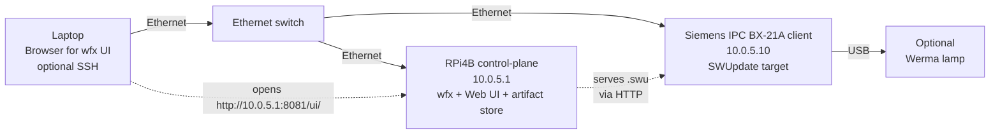
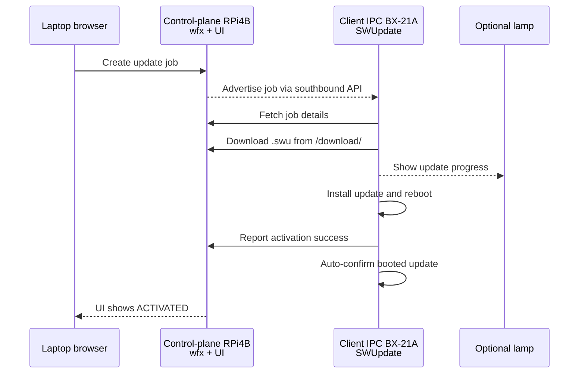

<!--
SPDX-FileCopyrightText: Copyright 2025 Siemens AG
SPDX-License-Identifier: MIT
-->

# Isar Demo

This is a demo project showcasing the use of [Isar](https://github.com/ilbers/isar) and [Isar-cip-core](https://gitlab.com/cip-project/cip-core/isar-cip-core) for building Debian-based images.

**Important Note:** This project is intended solely as a demo and should not be used as a basis for product development.

## Contents

- [Overview](#overview)
- [Base demo with QEMU AMD64](#base-demo-with-qemu-amd64)
- [Integrate a new feature: SWUpdate](#integrate-a-new-feature-swupdate)
- [wfx demo: Trigger SWUpdate via wfx](#wfx-demo-trigger-swupdate-via-wfx)
- [License](#license)

## Overview

Image variants:
- `demo-image`: Basic demo image with custom C application installed. A description of this image variant can be found [in this recording](https://youtu.be/j5OqhlvZGTE?si=nXsdTbEu_HAthn8G).
- `demo-image-swupdate`: Demo image with [SWUpdate]((https://github.com/sbabic/swupdate)) in place. This illustrates:
    - Read-only root filesystem with mutable data partition
    - A/B partitioning
    - Robust firmware updates via SWUpdate
    - SBOM reports via [debsbom](https://github.com/siemens/debsbom)
- `control-plane-image`: Control-plane image with [wfx](https://github.com/siemens/wfx) and web UI
- `demo-image-client` / `demo-image-client-update`: Client images for the wfx update flow

Targets:
- QEMU AMD64: Used for the base demo and feature integration
- Raspberry Pi 4B (ARM64): Used as the wfx control-plane in the wfx demo
- Siemens IPC BX-21A (AMD64): Used as the SWUpdate client in the wfx demo

## Base demo with QEMU AMD64

The build can be done using [`kas-container`](https://github.com/siemens/kas/blob/master/kas-container).
Please refer to the [kas user guide](https://kas.readthedocs.io/).
As `kas-container` performs builds in a containerized environment, install [Docker](https://docs.docker.com/engine/install/) or [Podman](https://podman.io/docs/installation).

### 1. Build the basic demo image

Build the [`demo-image`](meta-demo/recipes-core/images/demo-image_1.0.bb) for QEMU AMD64:

```
./kas-container build kas.yaml
```

Unpack the image:

```
unzstd build/tmp/deploy/images/qemuamd64/*.wic.zst
```

### 2. Boot the image in QEMU

Make sure that you have these packages installed on your Debian system:
- `qemu-system-x86`: For emulating Intel/AMD CPUs.
- `ovmf`: UEFI firmware for QEMU virtual machines.

Boot the image:

```
./start-qemu.sh amd64
```

Log in with user `root` (password: `root`).

From another shell, connect to the QEMU image via SSH:

```
ssh root@localhost -p 22222
```

## Integrate a new feature: SWUpdate

This section shows what needs to be considered when adding a new feature to the demo.
For this, we use the example of adding the image variant with SWUpdate (`demo-image-swupdate`).
The [Isar-cip-core](https://gitlab.com/cip-project/cip-core/isar-cip-core) repository provides recipes to get [SWUpdate](https://sbabic.github.io/swupdate/swupdate.html) up and running in an image.
Have a look at the [Isar-cip-core SWUpdate README](https://gitlab.com/cip-project/cip-core/isar-cip-core/-/blob/master/doc/README.swupdate.md).
In contrast to Isar-cip-core, where SWUpdate configurations are made via kas snippets, we define concrete machines and a dedicated image recipe for the implementation.

### 1. Add needed repositories to the kas configuration

*   In this case, include `isar-cip-core` into the [`kas.yaml`](kas.yaml).

    ```yaml
      repos:
        # ... other repos ...

        isar-cip-core:
          url: https://gitlab.com/cip-project/cip-core/isar-cip-core.git
          branch: master
    ```

    Make sure that the versions of `isar-cip-core` and `isar` are compatible.

*   Update [`kas.lock.yaml`](kas.lock.yaml): The `kas` lock file ensures that the build is reproducible by locking the commit hash of each repository.

    ```
    ./kas-container lock --update kas.yaml
    ```

### 2. Set SWUpdate options

- Machine-specific configurations should be placed in a dedicated `.conf` file: [`qemuamd64-swupdate.conf`](meta-demo/conf/machine/qemuamd64-swupdate.conf)

- Image-specific configurations should be done in a dedicated image recipe for SWUpdate: [`demo-image-swupdate_1.0.bb`](meta-demo/recipes-core/images/demo-image-swupdate_1.0.bb)

- kas target file: [`kas/qemu-swupdate.yaml`](kas/qemu-swupdate.yaml)

Build the image:

```
./kas-container build kas/qemu-swupdate.yaml
```

Unpack the image:

```
unzstd build/tmp/deploy/images/qemuamd64-swupdate/*.wic.zst
```

### 2. Boot the SWUpdate image

Boot the QEMU image with the swupdate machine configuration:

```
TARGET=demo-image-swupdate MACHINE=qemuamd64-swupdate ./start-qemu.sh amd64
```

### 3. Prepare an update artifact

To test the update process, produce an update image with a visible change.

*   Add a new package (e.g. `cowsay`) in [`demo-image-swupdate_1.0.bb`](meta-demo/recipes-core/images/demo-image-swupdate_1.0.bb):

    ```bitbake
    IMAGE_PREINSTALL += "cowsay"
    ```

*   Rebuild the image:

    ```
    ./kas-container build kas/qemu-swupdate.yaml
    ```

    This creates an updated `.swu` file in `build/tmp/deploy/images/qemuamd64-swupdate/`.

*   Copy the `.swu` file into the running QEMU machine via SSH:

    ```
    scp -P 22222 build/tmp/deploy/images/qemuamd64-swupdate/demo-image-swupdate-debian-trixie-qemuamd64-swupdate.swu root@localhost:
    ```

### 4. Run SWUpdate in the image

Follow the steps described in the [Isar-cip-core SWUpdate README](https://gitlab.com/cip-project/cip-core/isar-cip-core/-/blob/master/doc/README.swupdate.md#swupdate-verification).

*   Install the update artifact:

    ```
    swupdate -i demo-image-swupdate-debian-trixie-qemuamd64-swupdate.swu
    ```

*   After reboot, the system switches to the other rootfs partition and contains `cowsay`:

    ```
    root@isar-demo:~# /usr/games/cowsay Hello Isar
    ____________
    < Hello Isar >
    ------------
            \   ^__^
             \  (oo)\_______
                (__)\       )\/\
                    ||----w |
                    ||     ||
    ```

*   Confirm the successful update:

    ```
    bg_setenv -c
    ```

## wfx demo: Trigger SWUpdate via wfx

This demo triggers the SWUpdate flow through wfx.
It uses:
- a Raspberry Pi 4B as the **wfx control-plane**
- and a Siemens IPC BX-21A as the **SWUpdate client**.

### 1. Build the images

Build the control-plane image for Raspberry Pi 4B:

```
./kas-container build kas/control-plane.yaml
```

Unpack the control-plane image:

```
unzstd build/tmp/deploy/images/rpi-arm64-v8-efi/*.wic.zst
```

Build two client image variants for the Siemens IPC BX-21A:

- The client baseline (builds the bootable USB installer together with the target image):

    ```
    ./kas-container build kas/client.yaml
    ```

- The client update:

    ```
    ./kas-container build kas/client-update.yaml
    ```

Save the generated `.swu` and `.zck` artifacts as:

- `client-baseline.swu` with `client-baseline.zck`
- `client-update.swu` with `client-update.zck`

### 2. Set up the Raspberry Pi control-plane

Flash the control-plane image onto a micro SD card using `dd` or [Balena Etcher](https://etcher.balena.io/).
Boot the Raspberry Pi with the SD card inserted.
If using a serial USB cable, connect to the Raspberry Pi console:

```
screen /dev/ttyUSB0 115200
```

Connect the Raspberry Pi Ethernet port to your local switch/network.
The control-plane is configured with the static IP `10.0.5.1/24` (hostname: `isar-demo-server`).

Connect via SSH:

```
ssh root@10.0.5.1
```

### 3. Install the Siemens IPC BX-21A client

Unpack the installer image and flash it onto a USB.
Insert the USB into the Siemens IPC BX-21A, boot from it and complete the automated installation to internal storage.
The client is configured with the static IP `10.0.5.10/24` (hostname: `isar-demo-client`).

### 4. Connect the hardware



Confirm networking:

- On control-plane:

    ```
    ip -4 a
    ping -c 2 10.0.5.10
    ```

- On client:

    ```
    ip -4 a
    ping -c 2 10.0.5.1
    ```

### 5. Prepare for update

Copy the baseline and the update artifacts to the control-plane:

```
scp client-*.swu client-*.zck root@10.0.5.1:/var/lib/wfx/files/
```

Set permissions on the control-plane:

```
chmod 644 /var/lib/wfx/files/*
```

Verify wfx on the control-plane:

```
systemctl status wfx --no-pager
```

Open the wfx UI from the laptop:

```
http://10.0.5.1:8081/ui/
```

### 6. Trigger update

Use the helper script on the control-plane to create a wfx job for the client.

```
/usr/share/wfx-example/create-job.sh /var/lib/wfx/files/client-update.swu
```



The helper script submits a job for client id `isar-demo-client` and uses:

- Artifact directory: `/var/lib/wfx/files`
- Download base URL: `http://10.0.5.1:8080/download`

You can override defaults for one command if needed:

```
wfx_CLIENT_ID=isar-demo-client wfx_DOWNLOAD_BASE=http://10.0.5.1:8080/download /usr/share/wfx-example/create-job.sh /var/lib/wfx/files/client-update.swu
```

### 7. Observe progress and finish update

- Watch progress in wfx UI (`INSTALLING`, `ACTIVATING`, `ACTIVATED`).
- The update is automatically confirmed via `swupdate-confirm.service`

Afterwards, switch back to baseline:

```
/usr/share/wfx-example/create-job.sh /var/lib/wfx/files/client-baseline.swu
```

## License

This project is licensed according to the terms of the MIT License.
A copy of the license is provided in [LICENSE](LICENSE).
